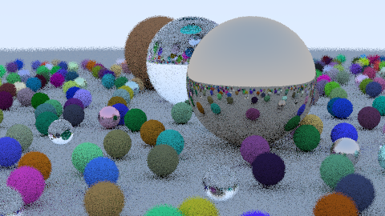

# Ray Tracing in "One" Weekend

A path tracer written in Python, inspired by Ray Tracing in One Weekend.

Renders a demo scene with diffuse, metal, and glass spheres to a PPM image file.



## Installation ⚙️

```bash
git clone <repo-url>
cd rtiow-python
uv sync
```

## Usage 📸

Run the raytracer to produce `output/image.ppm`:

```bash
uv run python -m raytracer
```

This can be opened with most image viewers, or converted with ImageMagick:

```bash
magick output/image.ppm output/image.png
```

## References 📚

- [_Ray Tracing in One Weekend_](https://raytracing.github.io/books/RayTracingInOneWeekend.html) - Peter Shirley, Trevor David Black, Steve Hollasch
